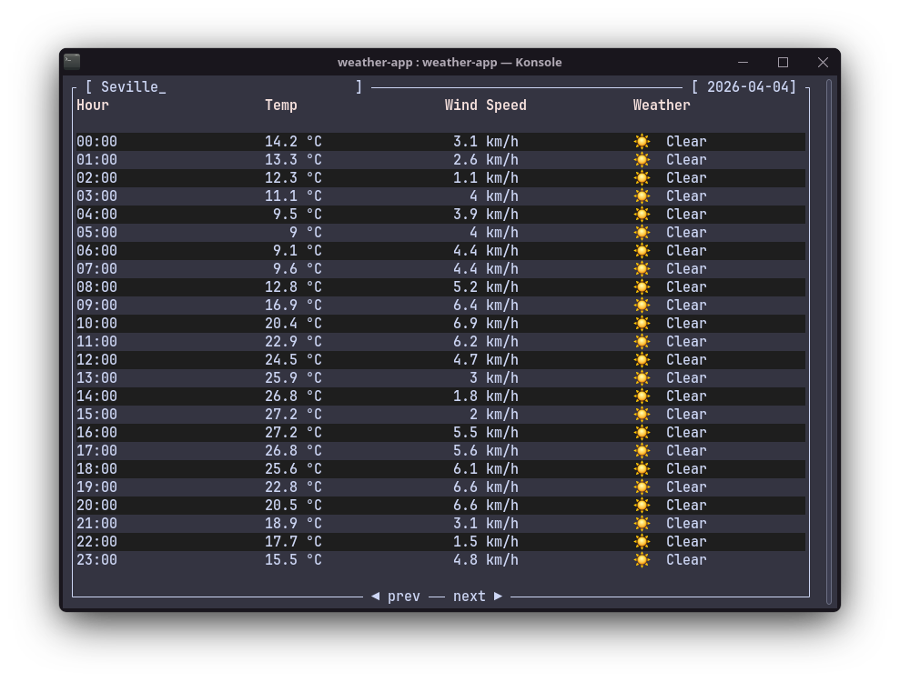

# Weather TUI

A terminal weather app built in rust.Get hourly forecasts for any city and navigate through the week.



## Features

- Hourly forecast for 7 days
- Live city search
- Powered by [Open-Meteo](https://open-meteo.com) — no API key needed

## Install

```bash
cargo install --path .
```

## Run

```bash
weather-tui
```

## Controls

| Key     | Action                |
|---------|-----------------------|
| `<` `>` | Navigate between days |
| `Type`  | Search for a city     |
| `Enter` | Fetch forecast        |
| `ESC`   | Quit                  |

## Built with

- [`ratatui`](https://github.com/ratatui/ratatui) — TUI framework
- [`reqwest`](https://github.com/seanmonstar/reqwest) — async HTTP client
- [`tokio`](https://tokio.rs) — async runtime
- [`serde`](https://serde.rs) — JSON deserialization